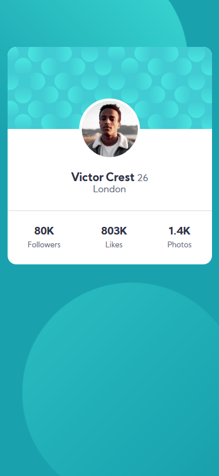

# Frontend Mentor - Profile card component solution

This is a solution to the [Profile card component challenge on Frontend Mentor](https://www.frontendmentor.io/challenges/profile-card-component-cfArpWshJ). Frontend Mentor challenges help you improve your coding skills by building realistic projects.

## Table of contents

- [Overview](#overview)
  - [The challenge](#the-challenge)
  - [Screenshot](#screenshot)
  - [Links](#links)
- [My process](#my-process)
  - [Built with](#built-with)
  - [What I learned](#what-i-learned)
  - [Continued development](#continued-development)
  - [Useful resources](#useful-resources)
- [Author](#author)
- [Acknowledgments](#acknowledgments)

## Overview

### The challenge

- Build out the project to the designs provided

### Screenshot




### Links

- Solution URL: [Final Solution]()
- Live Site URL: [Live Server]()

## My process

### Built with

- Semantic HTML5 markup
- CSS custom properties
- Flexbox
- Mobile-first workflow

### What I learned

```css
body {
  background-color: var(--primary-color);
  font-family: "Kumbh Sans", sans-serif;
  position: relative;
  background-image: url("../images/bg-pattern-top.svg"),
    url("../images/bg-pattern-bottom.svg");
  background-repeat: no-repeat;
  background-position: top -10vh left -14vmin, bottom -50vh right -10vmin;
  background-size: contain, contain;
}
}
```

### Continued development

In the future i want to learn to write css as close as possible to the design source

### Useful resources

- [w3school](https://www.w3schools.com/) - This helped me for guide with html, help to change pic when size change, etc.
- [flexbox malven](https://flexbox.malven.co/) - This is an amazing guide for referance when using flexboc. I'd recommend it to anyone still learning this concept.
- [css-trick](https://css-tricks.com/) - best article about css

## Author

- Website - [Aldi Anugra](https://github.com/LordAldi)
- Frontend Mentor - [@LordAldi](https://www.frontendmentor.io/profile/LordAldi)
- Instgram - [@aldi_anu](https://www.instagram.com/aldi_anu/)
- LinkedIn - [Aldi Anugra](https://www.linkedin.com/in/aldi-anugra-333132199/)
